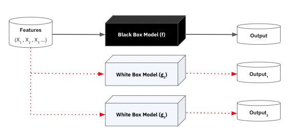

# Surrogate Analysis

대리 분석은 ‘대리(Surrogate)’라는 이름에서 알 수 있듯이 본래 인공지능 모델이 지나치게 복잡해서 해석이 불가능할 때 유사한 기능을 흉내 내는 모델 여러개를 대리로 만들어서 본래 모델을 해석하는 기법을 말한다.&#x20;

분석해야 할 모델을 f라고 할 때, f를 흉내내는 모델 g1과 g2를 만든다. f의 예측 결과와 가장 유사하게 학습된 모델(g1, g2 중 하나)이 f를 대신 설명할 대리 분석 모델이 된다. 모델 g를 결정하는 조건은 (1) 모델 f보다 학습하기 쉽고, (2) 설명 가능하며, (3) 모델 f를 유사하게 흉내 낼 수 있으면 된다.

#### 대리 분석의 장점

* 모델 애그노스틱(Model-agnostic technology, 모델에 대한 지식 없이도 학습할 수 있음)하다.&#x20;
* 적은 학습 데이터로도 설명 가능한 모델을 만들 수 있다.&#x20;
* 중간에 모델 f가 바뀌더라도 features만 같다면 대리 분석을 수행할 수 있다. 그 이유는 대리 분석 모델과 블랙박스 모델이 완전히 분리되어 (decoupled) 있기 때문이다.

#### 대리 분석의 두 가지 유형

* 글로벌 대리 분석(Global Surrogate Analysis) : 학습 데이터(전체 또는 샘플링)를 사용해서 블랙박스 모델을 따라하는 유사한 모델을 구축한다.&#x20;
* 로컬 대리 분석(Local Surrogate Analysis) : 모델이 학습 데이터 하나(individual data instance)를 해석하는 과정을 분석한다.

> Das, A., & Rad, P. (2020). Opportunities and challenges in explainable artificial intelligence (xai): A survey. arXiv preprint arXiv:2006.11371.

