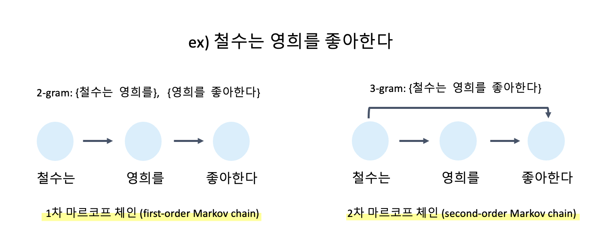

# What is N-gram used for? \(2\)

2-gram을 사용해 기존 노래 가사를 모방하는 **마르코프 체인\(Markov Chain\)**을 만들어서 새로운 문장을 생성해볼 수 있다. 

* 마르코프 체인은 과거의 데이터를 기반으로 예측을 하는 방법이다. 1개 또는 n개의 이전 상태가 주어졌을때 다음 상태가 나올 확률을 계산할 수 있다.
* 즉 2-gram을 사용해 마르코프 체인을 만들면 단어 하나가 다음 단어를 예측하게 되고, 3-gram이나 그 이상의 n-gram을 사용하면 두개 이상의 단어에서 다음 단어를 예측하게 된다.
* 이를 사용하여 문장을 자동으로 생성하는 것이 가능하다. 전체 텍스트를 검사하여 각각 단어에서 다음 단어가 나타나는 확률을 모두 구한다. 그리고 특정 단어로 시작하여 가장 높은 확률의 단어를 계속 선택하여 문장을 만들 수 있습니다.

다음의 그림 왼쪽에서 1차 마르코프 체인\(즉, 2-gram\) '좋아한다'가 나타날 확률은 '영희를'에만 영향을 받지 '철수는'에는 영향을 받지 않는다. 반면 오른쪽의 2차 마르코프 체인\(즉, 3-gram\) '좋아한다'가 나타날 확률은 '철수는'과 '영희를'의 영향을 받게 된다. 따라서 N-gram의 N을 늘릴 수록 좀 더 자연스럽게 문장을 생성하는 마르코프 체인을 만들 수 있다. 예시에서는 1차 마르코프 체인을 사용해서 문장을 생성해본다.



```python
# 멜론(Melon) 음악 차트를 크롤링하여 장르별 Top50의 노래 가사 수집
Ballade_url = 'https://raw.githubusercontent.com/Sol-J/Study/master/data/melon_ballade_top50.csv' 
Hiphop_url = 'https://raw.githubusercontent.com/Sol-J/Study/master/data/melon_hiphop_top50.csv' 
Trot_url = 'https://raw.githubusercontent.com/Sol-J/Study/master/data/melon_trot_top50.csv' 

Ballade = pd.read_csv(Ballade_url) 
Hiphop = pd.read_csv(Hiphop_url)
Trot = pd.read_csv(Trot_url)

Ballade.head()
```

```python
lyrics= Hiphop['가사'].tolist()
Hiphop_lyrics = ' '.join(lyrics)

lyrics= Ballade['가사'].tolist()
Ballade_lyrics = ' '.join(lyrics)

lyrics= Trot['가사'].tolist()
Trot_lyrics = ' '.join(lyrics)
```

```python
def wordListSum(wordList): 
    sum = 0
    for word, value in wordList.items(): #딕셔너리에서 key와 value 쌍을 반환
        sum += value 
    return sum #word 빈도 합계를 반환

#딕셔너리를 받고 그 딕셔너리에 있는 단어들의 빈도를 참고해서 무작위 단어를 생성한다.
def retrieveRandomWord(wordList):
    randIndex = randint(1, wordListSum(wordList))
    for word, value in wordList.items():
        randIndex -= value 
        if randIndex <= 0: #이어서 동일한 인덱스를 가진 단어가 나오지 않도록 함
            return word

#wordDict을 만들면 현재 단어가 무엇이든 간에 다음 단어로 찾아갈 수 있는 검색 테이블 구실을 할 수 있다.
def buildWordDict(text): 
    # 줄바꿈 문자와 따움표를 제거한다.
    text = text.replace('\n', ' ');
    text = text.replace('"', '');
    
    # 구두점 역시 단어로 취급해서 마르코프 체인에 들어가도록 한다.
    punctuation = [',','.',';',':']
    for symbol in punctuation:
        text = text.replace(symbol, ' {} '.format(symbol));

    words = text.split(' ')
    # 빈단어를 제거한다.
    words = [word for word in words if word != '']
    
    wordDict = {}
    for i in range(1, len(words)):
        if words[i-1] not in wordDict:
            # 이 단어에 필요한 새 딕셔너리를 만듭니다.
            wordDict[words[i-1]] = {}
        if words[i] not in wordDict[words[i-1]]:
            wordDict[words[i-1]][words[i]] = 0
        wordDict[words[i-1]][words[i]] += 1
    return wordDict
```

```python
wordDict_B = buildWordDict(Ballade_lyrics)
wordDict_H = buildWordDict(Hiphop_lyrics)
wordDict_T = buildWordDict(Trot_lyrics)

length = 10
chain_B = ['사랑을']
chain_H = ['사랑을']
chain_T = ['사랑을']

for i in range(0, length):
    newWord_B = retrieveRandomWord(wordDict_B[chain_B[-1]]) # 1차 마르코프 체인
    chain_B.append(newWord_B)

    newWord_H = retrieveRandomWord(wordDict_H[chain_H[-1]])
    chain_H.append(newWord_H)   

    newWord_T = retrieveRandomWord(wordDict_T[chain_T[-1]])
    chain_T.append(newWord_T)   

print('발라드 : ',' '.join(chain_B))
print('힙합 : ',' '.join(chain_H))
print('트로트 : ',' '.join(chain_T))
```

```python
발라드 :  사랑을 하면 할수록 뭐 그리도 어려운 건지 홀로 남겨질 내게 왔던
힙합 :  사랑을 썼고 하루 신이 있다면 고민 따위를 하덜덜 마 쉽게 웃어주는
트로트 :  사랑을 알겠지 이쁜 사람 버들피리 불던 내 님 곁으로 늦기 전에
```


