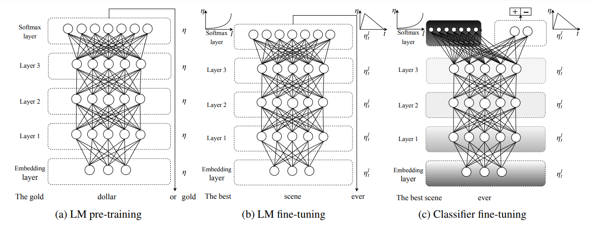

# Pre-training

 이어서 워드 임베딩 과정에서 Pre-trained model을 활용한 ULMFiT와 GPT에 대해 소개한다. 

 우선 현재의 자연어처리 응용에 있어서 지배적인 개념으로 자리 잡은 Pre-training과 Fine-tuning, Transfer learning에 대해서 간단히 살펴본다. Pre-training, Fine-tuning, Transfer learning은 같은 맥락에 있는 개념으로, Pre-training 된 모델을 Fine-tuning해서 새롭게 응용하는 과정을 Transfer learning이라고 한다. 즉 Transfer learning이란 다량의 unlabeled data에 대하여 학습을 한 후, 학습된 모델의 가중치를 활용하여 소량의 labeled data에 대해서 분류, 추론 등의 task를 수행하는 것이다. 실제 데이터가 부족한 상황에서 유용하게 활용될 수 있는 개념이다. 이 과정에서 초기에 모델의 가중치를 초기화 할 때 임의의 값을 사용하는 것이 아니라, 다른 task에서 학습시킨 가중치를 사용한다.

 **Universal Language Model Fine-Tuning for Text Classification \(ULMFiT**\)은 사전 학습된 언어 모델을 Classification 문제로 Transfer하여 학습하는 방법론이다. 모델의 아키텍처는 아래 그림과 같으며, 총 3단계의 흐름으로 구성되어 있다. 사전에 대량의 코퍼스를 기반으로 general-domain의 언어 모델을 학습한 뒤, 이 모델을 새로운 Text Classification 태스크에 맞춰서 미세 조정한 다음, 마지막으로 Softmax 분류 레이어를 추가적으로 학습한다. 이러한 ULMFiT은 다른 모델에 비해 더 적은 양의 데이터만으로도 우수한 예측 성능을 보였다. 

* \(a\) General-domain Language Model Pre-training
* \(b\) Target task Language Model fine-tuning
* \(c\) Target task Classifier fine-tuning



 **Generation Pre-trained Transformer \(GPT\)**는 Transformer의 디코더 부분을 사용한 언어 모델이다. OpenAI 사에서 GPT-n 시리즈로 발전된 버전들을 선보이고 있으며, 현재 3세대 모델까지 나왔다. 각 시리즈별 논문은 아래와 같다. 

* GPT1 - Improving Language Understanding by Generative Pre-Training
* GPT2 - Language Models are Unsupervised Multitask Learners
* GPT3 - Language Models are Few-Shot Learners

\(작성중\)

